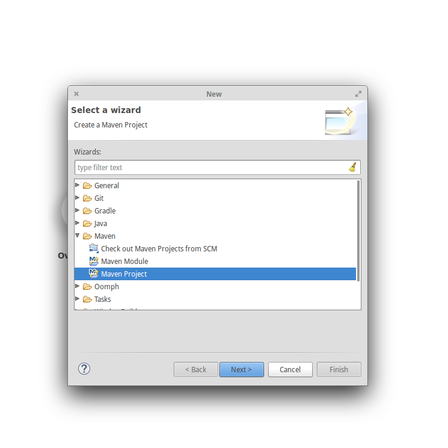

# Create a Open Eval client project using Eclipse

In order to use the Open Eval system you will need to run a learner endpoint. This endpoint allows the Open Eval system to communicate with your machine learner. This tutorial will walk you through how to create a project and configure a project. Then it will explain how to start a run of the Open Eval system. Although Eclipse is used here, the general setup should be easily transferable to other IDE's.

## Part 1: Creating a Maven project

The libraries to run the client server are hosted on a Maven repository. Because of this, it will be necessary to create a Maven project.

Open Eclipse and navigate to _File > New > Other_


Now select the _Maven > Maven Project_ option



Input some info about your project. Your project can differ from the image below. Click finish.


## Part 2: Adding the Maven repository and dependency

Now that your project is created, we can add the repository and dependency so we can access the learner endpoint. Open the `pom.xml` file that was generated. It will be in the root directory. From the tabs at the bottom of the editing page select the *pom.xml* tab. Paste the following xml above the final "\</project>" tag.

```xml
<repositories>
    <repository>
        <id>CogcompSoftware</id>
        <name>CogcompSoftware</name>
        <url>http://cogcomp.cs.illinois.edu/m2repo/</url>
    </repository>
</repositories>

<dependencies>
    <dependency>
        <groupId>edu.illinois.cs.cogcomp</groupId>
        <artifactId>openeval-client_2.11</artifactId>
        <version>#version</version>
    </dependency>
</dependencies>
```

where `#version` entry replaced with the version listed in this project's `build.sbt` file.

Your editor should look like the following.


## Part 3: Implement an `Annotator` and create a main method

The `Annotator` is the interface through which the learner endpoint communicates with your machine learner. If you would like to learn more about this you can read more in the [learner documentation](https://github.com/IllinoisCogComp/open-eval/tree/master/learner). For this tutorial you can just create a java file in "src/main/java" called "ToyPosAnnotator.java". In this file copy the below code.

```java
import edu.illinois.cs.cogcomp.annotation.Annotator;
import edu.illinois.cs.cogcomp.annotation.AnnotatorException;
import edu.illinois.cs.cogcomp.core.datastructures.ViewNames;
import edu.illinois.cs.cogcomp.core.datastructures.textannotation.Constituent;
import edu.illinois.cs.cogcomp.core.datastructures.textannotation.TextAnnotation;
import edu.illinois.cs.cogcomp.core.datastructures.textannotation.View;
import edu.illinois.cs.cogcomp.nlp.utilities.POSUtils;

import java.io.IOException;
import java.util.List;
import java.util.Random;

public class ToyPosAnnotator extends Annotator
{
    public ToyPosAnnotator()
    {
        // The problem we are trying to solve is parts of speech (POS)
        // The view we require is TOKENS
        super(ViewNames.POS, new String[] {ViewNames.TOKENS});
    }

    @Override
    public void addView(TextAnnotation textAnnotation) throws AnnotatorException
    {
        String[] tokens = textAnnotation.getTokens();
        List<String> tags = POSUtils.allPOS;

        // Create a new view with our view name (the other fields are unimportant for this example)
        View posView = new View(ViewNames.POS,"POS-annotator",textAnnotation,1.0);
        textAnnotation.addView(ViewNames.POS,posView);

        Random random = new Random();

        for(int i=0;i<tokens.length;i++){
            // For this example we will just randomly assigning tags.
            int randomTagIndex = random.nextInt(tags.size());
            // Add the tag to the view for the specified token
            posView.addConstituent(new Constituent(tags.get(randomTagIndex),ViewNames.POS,textAnnotation,i,i+1));
        }
    }
}
```

Compile your project to make sure everything has been set up correctly so far. If you run into issues where imports cannot be found make sure that you imported the dependencies through maven.

Now we will add the main method. We need to construct the `Annotator` and give it to the `Server` which will handle the communications. The `Server` also takes `ServerPreferences` which are preferences the `Server` will take into account when communicating with the core system. The first number in this pair has not been implemented yet and can be ignored. The second is the maximum number of instances you want to be sent at one time. *Warning:* If you set this number to high it might cause timeout issues. We recommend 50 for most task.

Once you have created your `Server` you can run it using `ServerRunner.executeInstance`. Code doing the that with our `ToyPosAnnotator` is shown below.

```java
public static void main(String args[]) throws IOException {
    // Create the annotator
    Annotator annotator = new ToyPosAnnotator();

    // We will have our server listen on port 5757 and pass it our toy annotator
    // Tell the client to request batches with 50 instances, the first number can be ignored for now
    Server server = new Server(5757, new ServerPreferences(0, 50), annotator);

    // We have no more work to do, so we will use the executeInstance method to start and keep our Server alive
    fi.iki.elonen.util.ServerRunner.executeInstance(server);
}
```

You should now be able to compile and run this program. If it is successful it should print "Your learner endpoint is listening at this address..."

You can press enter in the terminal to end the program.

## Part 5: Run the learner endpoint with the Open Eval system

Start your learner endpoint. Open a browser and go to the Open Eval site. Log in or create an account if needed. Create a configuration with your desired dataset and task. For our example it is "500" and "POS". 

On the configurations page click the "Run" button. Enter in the URL printed by the learner endpoint. Please note, in order to use the Open Eval system, the server must be on the same network as your learner endpoint. This can be achived through a vpn. If you are using a vpn the URL printed out might not be accurate. In this case run ipconfig on windows or ifconfig on mac/linux and find your vpn ip address. In the create run form enter in your url in the following format: http://{ip}:{port}/.


If everything is successful you should see the progress bar start to increase gradually. If you are still haveing issues check your firewall.


